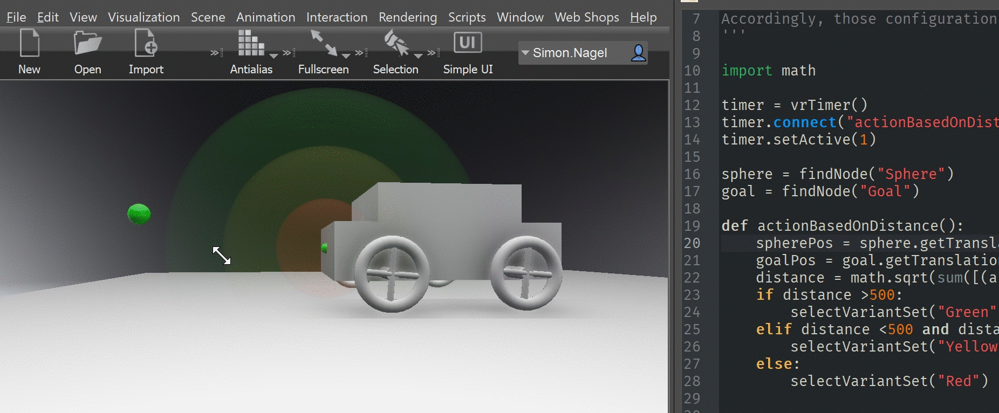

# Vred-actionBasedOnDistance

### vrTimer-actionBasedOnDistance:
Simple Example on how create action based on distance between objects. In this scenario a variant is executed if certain distance values are reached

